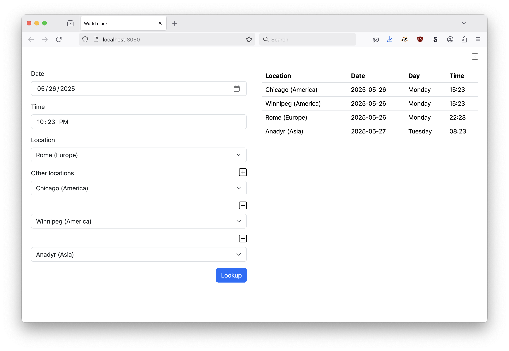

# go-world-clock

There are many world clocks. This one is mine.

## Documentation

Documentation is in progress and incomplete at this time.

[](https://pkg.go.dev/github.com/aaronland/go-world-clock)

## Usage

```
import (
	"log"
        "time"

	"github.com/aaronland/go-world-clock"
)

func main(){

	now := time.Now()
	here := now.Local()

	filters := &clock.Filters{
		Timezones: []string{ "Montreal" },
	}

	results, _ := clock.Time(ctx, here, filters)

	for _, r := range results {
		log.Printf("%s %s\n", r.Timezone, r.Time.Format(time.RFC3339))
	}
}
```

## Tools

### time

Print the local time as well as the time in one or more timezones.

```
$> ./bin/time -h
Print the local time as well as the time in one or more timezones.

Usage:
	 ./bin/time [options]

Valid options are:
  -date string
    	YYYY-MM-dd HH:mm. If empty the current time in the computer's locale will be used.
  -in value
    	Zero or more strings to test whether they are contained by a given timezone's longform (major/minor) label.
  -timezone string
    	A valid major/minor timezone location. Required if -date is not empty.
```

#### Example:

```
$> ./bin/time -date '2023-12-31 20:32' -timezone America/Montreal -in Europe/London -in Australia/Melbourne
Montreal (America)      2023-12-31   Sunday   20:32
London (Europe)         2024-01-01   Monday   01:32
Melbourne (Australia)   2024-01-01   Monday   12:32
```

## Web (WASM)

There is also a simple web application, with offline support, which uses the methods provided by this package exported as a WebAssembly (WASM) binary.

You will need to serve the web application from a web server (because you can't load WASM binaries from `file://` URLs) but any old web server should do the trick. I like to use the [aaronland/go-http-fileserver](https://github.com/aaronland/go-http-fileserver?tab=readme-ov-file#fileserver) tool but that is mostly because I wrote it. You can use whatever you want. For example:

```
$> make server
fileserver -root www
2025/05/15 09:29:54 Serving www and listening for requests on http://localhost:8080
```

And then when you open your web browser to `http://localhost:8080` you should see something like this:


After you enter some dates, times and places you should see something like this:



The application is also responsive so on smaller screens the results are shown beneath the input form:


### Notes

#### Mobile

Unfortunately there is no "typeahead" functionality when selecting timezones on mobile devices. This means scrolling through a very long list (there are a lot of timezones) which isn't great.

#### Maps, geocoders, selecting cities rather than timezones

It's on the list. For now, there are just timezones.

#### File sizes

The `world_clock_time.wasm` WASM binary which does all the heavy lifting is approximately 4MB. This is not necessarily the most "efficient" way to do things but in addition to wanting a simple offline application I also wanted to continue investigating the use of WASM binaries for providing functionality in (offline) web applications. Go produces large binaries, certainly compared to the size of equivalent functionality written in JavaScript. I can live with a 4MB WASM binary for now.

#### Offline mode

Offline mode _should_ work without any problems. It _seems_ to work for me but ServiceWorkers and offline-anything in browsers can be fussy and brittle so if you tell me it doesn't work for you I won't be overly surpised.

#### Building

The `world_clock_time.wasm` binary comes precompiled with this package but if you need, or want, to revuild the `world_clock_time.wasm` binary the easiest way to do that it is to use the handy `wasmjs` Makefile target:

```
$> make wasmjs
GOOS=js GOARCH=wasm \
		go build -mod vendor -ldflags="-s -w" -tags wasmjs \
		-o www/wasm/world_clock_time.wasm \
		cmd/time-wasm/main.go
```		